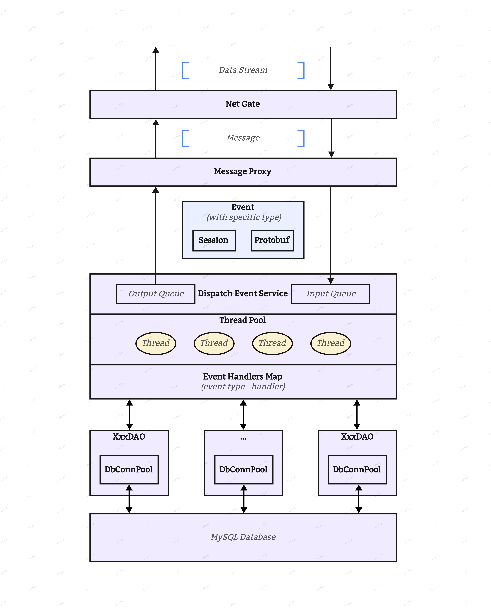

# Shbk2

Shbk2 是一个简单的基于 Reactor 模型和线程池的网络框架。这个框架符合 C/C++ 网络编程中常见的 “one loop per thread” 的理念，也就是每个事件循环独占一个线程，而每个循环中的事务则由线程池中的线程处理。

## 1. 依赖列表

- [libevent](https://github.com/libevent/libevent)
- [tiny-thread-pool](https://github.com/Lau0120/tiny-thread-pool)
- [protobuf](https://github.com/protocolbuffers/protobuf)
- [spdlog](https://github.com/gabime/spdlog)
- [toml11](https://github.com/ToruNiina/toml11)

## 2. 框架概述

### 2.1. 核心

模块 [NetGate](./src/net_gate/net_gate.h) 承担了监听 TCP 连接、读写数据的任务。底层高度依赖于 `libevent` 事件库所实现的基于 [epoll](https://www.man7.org/linux/man-pages/man7/epoll.7.html) 的 Reactor 模型，通过系统提供的事件循环高效地以同步的方式处理连接和请求。在响应连接时将创建关联于连接的 _Session_ 实例以管理连接的生命周期。

模块 [Session](./src/session/session.h) 以追踪和管理 TCP 连接的生命周期，此外还提供了状态存储等额外的功能。从某种程度上类似于传统互联网项目中 redis 数据库所承担的缓存功能，区别在于 _Session_ 实例被存储在 `libevent` 的事件循环中。

模块 [MessageProxy](./src/msg_proxy/msg_proxy.h) 承担了将消息转换特定类型事件以及将特定类型事件转换消息的任务。内部利用每个 TCP 连接所对应的 _Session_ 实例中的 buffer 解决了常见的 “分包” 与 “粘包” 问题。

模块 [DispatchEventService](./src/des/des.h) 承担两个任务：存储特定类型事件所对应的事件处理函数对象、执行所有待处理事件以及存储相应的结果事件。底层依赖于带有输入输出队列的线程池 `tiny-thread-pool`，所有的待处理事件将存放于线程池的输入队列中，所有的响应事件将存放于线程池的输出队列中。

模块 [EventHandlers](./src/event_handlers/event_handlers.h) 包含了事件处理的接口以及针对不同事件类型的事件处理类。不同事件处理类的实例（可以被视作函数对象）往往在项目启动时被注册到 _DispatchEventService_ 模块内部。

### 2.2. 事件相关

模块 [Protobuf](./src/shbk2pb/shbk2.pb.h) 提供了将程序运行时数据实体序列化和反序列化的功能以便于数据的传输。底层依赖于 google 的 `protobuf` 数据序列化库。由 .proto 文件编译而成的类实际上也包含了数据实体类的定义。

模块 [Events](./src/events/events.h) 提供了事件相关的接口（序列化和反序列化等）以及不同类型事件的定义。不同的事件类型本质上是 _Protobuf_ 模块中某个数据实体的封装。此外也包含了相应 _Session_ 实例的引用以实现状态管理。

### 2.3. 数据库相关

模块 [DBConnectionPool-Mysql](./src/dbcp_mysql/dbcp_mysql.h) 是一个非常简单的附有超时机制的适用于多线程的 MySQL 数据库连接池，包含了数据库连接、执行 SQL 语句以及访问查询结果的功能。底层的实现依赖于 MySQL 官方的 C 版本 API。组合利用此模块中包含的类可以很好地实现数据库的连接和数据传输。

模块 [DbAgentObject](./src/dao/dao.h) 是在 _DBConnectionPool-Mysql_ 模块上的一层封装。不同的数据对象可以有不同的 _DbAgentObject_ 以实现特定的功能。每个 _DbAgentObject_ 可以包含一个数据库连接池从而简化连接池的管理。此模块通常被 _EventHandlers_ 模块调用以实现数据的持久化存储。
